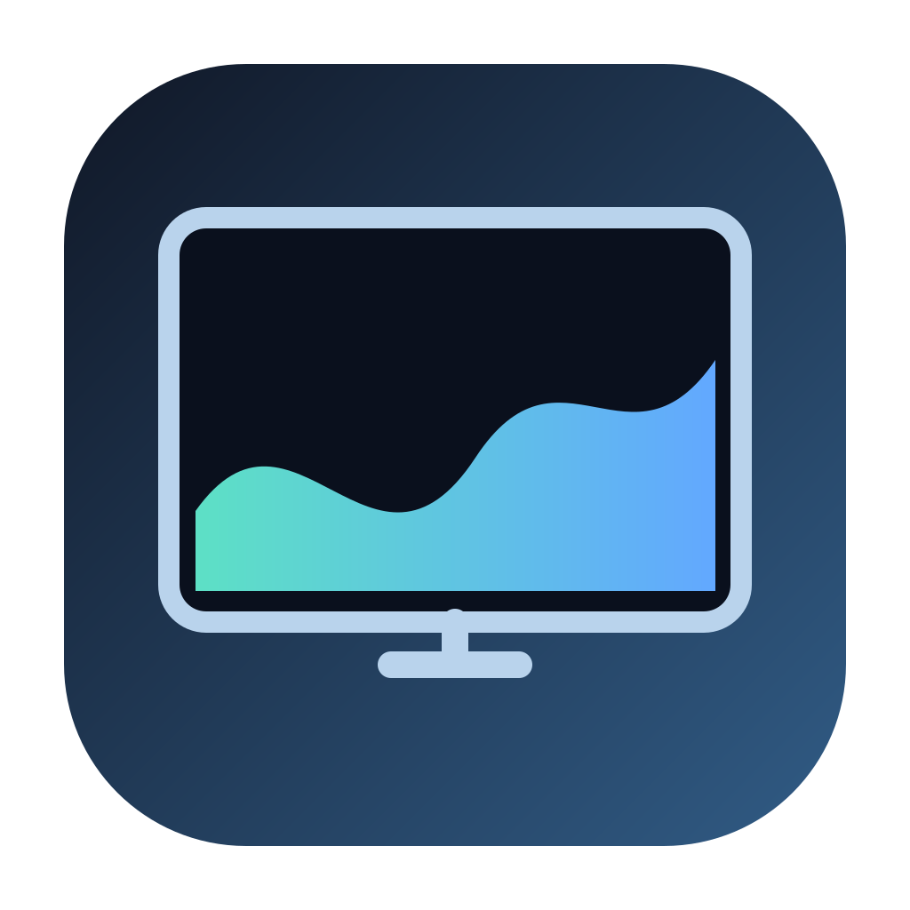
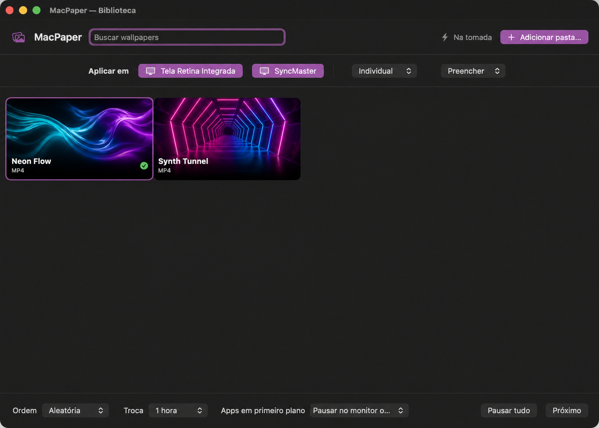

<p align="center">
  
</p>

<h1 align="center">MacPaper</h1>

<p align="center">
  A lightweight, native animated wallpaper engine for macOS.<br>
  The open alternative to Wallpaper Engine and Lively Wallpaper — built in Swift, with battery life in mind.
</p>

<p align="center">
  <a href="https://github.com/IgorComicsTV/macpaper/releases/latest"></a>
  <a href="https://github.com/IgorComicsTV/macpaper/releases"></a>
  
  
  <a href="https://github.com/IgorComicsTV/macpaper/stargazers"></a>
</p>

<p align="center">
  <a href="https://github.com/IgorComicsTV/macpaper/releases/latest/download/MacPaper-2.0.3-macOS-arm64.zip"><strong>⬇ Download MacPaper for macOS</strong></a>
  ·
  <a href="#build-from-source">Build from source</a>
  ·
  <a href="#português">Português</a>
</p>



## Why MacPaper?

MacPaper turns your videos into beautiful animated desktops without the weight of a browser engine. It uses native Apple frameworks, hardware video decoding, and a shared rendering pipeline to keep multiple displays synchronized while using fewer resources.

## Highlights

- **Visual wallpaper library** — searchable cards with automatically generated thumbnails.
- **Frame-synchronized displays** — one master playback timeline for every grouped monitor.
- **Three display modes** — Individual, Mirrored, and Spanned.
- **Flexible framing** — Fill, Fit, or Stretch each video.
- **Per-display smart pause** — pause only the monitor occupied by the foreground app.
- **Playlists and timers** — sequential or random rotation from 15 minutes to 24 hours.
- **Battery-aware playback** — automatic HEVC 1080p/30 fps optimized copies for demanding videos.
- **Menu bar native** — pause, skip, launch at login, clear cache, and quit.
- **Private by design** — no account, analytics, uploads, server, or network connection.

## Multi-display modes

| Mode | Behavior |
| --- | --- |
| **Individual** | Each display can run its own wallpaper and playlist. |
| **Mirrored** | Every selected display shows the exact same frame. |
| **Spanned** | One video canvas stretches naturally across the physical display arrangement. |

When a display is paused because an app is in front, the shared timeline continues on the other screens. As soon as the display is free, it rejoins at the current synchronized frame.

## Install

1. Download [`MacPaper-2.0.3-macOS-arm64.zip`](https://github.com/IgorComicsTV/macpaper/releases/latest/download/MacPaper-2.0.3-macOS-arm64.zip).
2. Extract it and move **MacPaper.app** to `/Applications`.
3. On the first launch, Control-click the app and choose **Open**.
4. Add a folder containing `.mp4`, `.mov`, or `.m4v` files.
5. Choose your displays and layout, then click a wallpaper.

> The downloadable build is ad-hoc signed and not notarized yet. macOS may require the Control-click → Open flow on first launch.

## Energy efficiency

MacPaper is designed to disappear when it is not useful:

- Video is decoded using AVFoundation and rendered with Metal.
- Synchronized displays share one decoding pipeline.
- Rendering stops on locked, sleeping, disconnected, or paused displays.
- Heavy sources get an optimized HEVC proxy for battery use; originals stay untouched.
- Audio is muted and disabled.

## Build from source

No Xcode project is required.

```bash
git clone https://github.com/IgorComicsTV/macpaper.git
cd macpaper
./scripts/build.sh
```

The script uses Swift and the Apple Command Line Tools, runs verification checks, builds the icon and app bundle, then ad-hoc signs `outputs/MacPaper.app`.

Requirements:

- Apple Silicon Mac
- macOS 14 or newer
- Apple Command Line Tools (`xcode-select --install`)
- Swift 6-compatible toolchain

## Architecture

- **SwiftUI + AppKit** for the library, menu bar, and desktop-level windows.
- **AVFoundation** for playback, looping, metadata, thumbnails, and optimization.
- **Metal + Core Image** for one-frame/many-display rendering.
- **ServiceManagement** for launch at login.
- **IOKit** for power-source awareness.

## Roadmap

- [ ] Intel Mac build
- [ ] Signed and notarized downloads
- [ ] Drag-and-drop video import
- [ ] Per-wallpaper playback speed
- [ ] Community wallpaper packs
- [ ] Automatic updater

## Contributing

Issues and pull requests are welcome. If MacPaper makes your desktop better, please ⭐ **star the repository** — it helps more macOS users discover the project.

When reporting a bug, include your macOS version, Mac model, number of displays, video format, and the steps needed to reproduce it.

## Português

O MacPaper é uma alternativa nativa e gratuita ao Wallpaper Engine/Lively Wallpaper para macOS. Ele reproduz vídeos como wallpaper, sincroniza múltiplos monitores, oferece playlists e pausa somente a tela ocupada por um aplicativo em primeiro plano.

Baixe a versão mais recente em [Releases](https://github.com/IgorComicsTV/macpaper/releases/latest). Se gostar do projeto, deixe uma ⭐ para ajudar outras pessoas a encontrá-lo.

---

<p align="center">Built for macOS with Swift, AVFoundation and Metal.</p>
